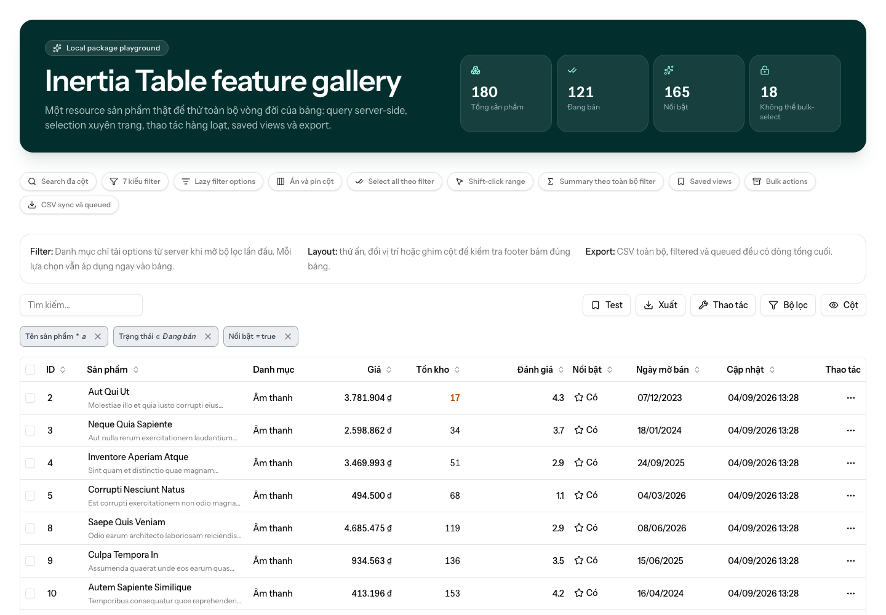

# Musing Inertia Table

[](https://github.com/thienbd203/inertia-table/actions/workflows/run-tests.yml)
[](https://github.com/thienbd203/inertia-table/actions/workflows/run-js-tests.yml)
[](https://github.com/thienbd203/inertia-table/actions/workflows/run-docs.yml)
[](https://packagist.org/packages/musing/inertia-table)
[](https://packagist.org/packages/musing/inertia-table)

**Server-driven data tables for Laravel, Inertia.js, and Vue.** Declare columns,
search, filters, actions, and exports in PHP, then render the result with one Vue
component.

The server remains authoritative: browser input can use only capabilities
declared by the table. Each table keeps isolated URL state, and
[Spatie Laravel Query Builder](https://spatie.be/docs/laravel-query-builder/v7/introduction)
executes the allowlisted query.

> [!WARNING]
> The package is under active development before v1.0. Minor releases may
> contain API changes.



## Features

| Capability  | Included                                                                                                                                                                                                        |
| ----------- | --------------------------------------------------------------------------------------------------------------------------------------------------------------------------------------------------------------- |
| Querying    | Server-side [search and filters](https://thienbd203.github.io/inertia-table/guide/search-and-filters), sorting, [relationships](https://thienbd203.github.io/inertia-table/guide/relationships), and pagination |
| Layout      | [Visibility, order, resizing, and sticky columns](https://thienbd203.github.io/inertia-table/guide/columns)                                                                                                     |
| Workflows   | [Row and bulk actions](https://thienbd203.github.io/inertia-table/features/actions), all-matching selection, [queues](https://thienbd203.github.io/inertia-table/features/queues), and progress                 |
| Reporting   | Complete-result [summaries](https://thienbd203.github.io/inertia-table/features/summaries) and [CSV, XLSX, or PDF exports](https://thienbd203.github.io/inertia-table/features/exports)                         |
| Preferences | [Namespaced URL state](https://thienbd203.github.io/inertia-table/guide/pagination-and-url-state) and scoped [Saved Views](https://thienbd203.github.io/inertia-table/features/saved-views)                     |
| Rendering   | Vue renderer, [typed composables, slots, and CSS hooks](https://thienbd203.github.io/inertia-table/customization/rendering-and-slots), plus English and Vietnamese                                              |

Explore the [documentation](https://thienbd203.github.io/inertia-table/) or the
[playground source](https://github.com/thienbd203/inertia-table-playground).

## Requirements

| Layer          | Requirement                                           |
| -------------- | ----------------------------------------------------- |
| PHP            | 8.3+                                                  |
| Laravel        | 12 or 13                                              |
| Inertia        | Laravel 2 or 3; Vue 3.4+                              |
| Query engine   | Spatie Laravel Query Builder 7                        |
| Frontend peers | Tailwind CSS 4.1+, Reka UI 2.10+, `@lucide/vue` 1.30+ |

## Installation

```bash
composer require musing/inertia-table
npm install @musing/inertia-table-vue
```

Add the package's Vue source to the host application's Tailwind stylesheet:

```css
/* resources/css/app.css */
@source '../../node_modules/@musing/inertia-table-vue/resources/js/**/*.vue';
```

Import the renderer stylesheet once in the application entry point:

```ts
import "@musing/inertia-table-vue/style.css";
```

## Quick start

Use an existing Laravel/Inertia/Vue app with a `Topic` model and `id`, `name`,
`status`, and timestamp columns. The [getting started guide](https://thienbd203.github.io/inertia-table/guide/getting-started)
includes the route, page location, and troubleshooting steps.

Generate a table:

```bash
php artisan make:inertia-table TopicsTable --model=Topic
```

Declare the query and its browser-facing capabilities:

```php
<?php

namespace App\Tables;

use App\Models\Topic;
use Illuminate\Database\Eloquent\Builder;
use Musing\InertiaTable\Columns\DateTimeColumn;
use Musing\InertiaTable\Columns\TextColumn;
use Musing\InertiaTable\Filters\SetFilter;
use Musing\InertiaTable\Table;

final class TopicsTable extends Table
{
    protected ?string $defaultSort = 'name';

    public function query(): Builder
    {
        return Topic::query();
    }

    public function columns(): array
    {
        return [
            TextColumn::make('name')->searchable()->sortable(),
            DateTimeColumn::make('created_at', 'Created')->sortable(),
        ];
    }

    public function filters(): array
    {
        return [
            SetFilter::make('status')->options([
                'published' => 'Published',
                'draft' => 'Draft',
            ]),
        ];
    }
}
```

Return the table from an Inertia controller:

```php
use App\Tables\TopicsTable;

return inertia('Topics/Index', [
    'topics' => TopicsTable::make(),
]);
```

Render it in Vue:

```vue
<script setup lang="ts">
import { DataTable, type TableResource } from "@musing/inertia-table-vue";

type Topic = {
    id: number;
    name: string;
    status: string;
    created_at: string;
};

defineProps<{ topics: TableResource<Topic> }>();
</script>

<template>
    <DataTable :resource="topics" />
</template>
```

This provides server-side search, sorting, filtering, pagination, URL state,
column controls, and the standard empty-state UI. Continue with the
[getting started guide](https://thienbd203.github.io/inertia-table/guide/getting-started).

## Documentation

- [Search and filters](https://thienbd203.github.io/inertia-table/guide/search-and-filters)
- [Actions and selection](https://thienbd203.github.io/inertia-table/features/actions)
- [Queues](https://thienbd203.github.io/inertia-table/features/queues)
- [Exports](https://thienbd203.github.io/inertia-table/features/exports)
- [Saved Views](https://thienbd203.github.io/inertia-table/features/saved-views)
- [Relationships](https://thienbd203.github.io/inertia-table/guide/relationships)
- [Customization](https://thienbd203.github.io/inertia-table/customization/rendering-and-slots)
- [PHP API](https://thienbd203.github.io/inertia-table/reference/php-api)
- [Vue API](https://thienbd203.github.io/inertia-table/reference/vue-api)

## Packages and project links

- [Packagist: `musing/inertia-table`](https://packagist.org/packages/musing/inertia-table)
- [npm: `@musing/inertia-table-vue`](https://www.npmjs.com/package/@musing/inertia-table-vue)
- [GitHub repository](https://github.com/thienbd203/inertia-table)
- [Issue tracker](https://github.com/thienbd203/inertia-table/issues)

## Development

See the [contributor guide](https://thienbd203.github.io/inertia-table/internals/development)
for local setup, test suites, contract fixtures, and documentation commands.

## License

Musing Inertia Table is open-source software licensed under the
[MIT license](LICENSE.md).
